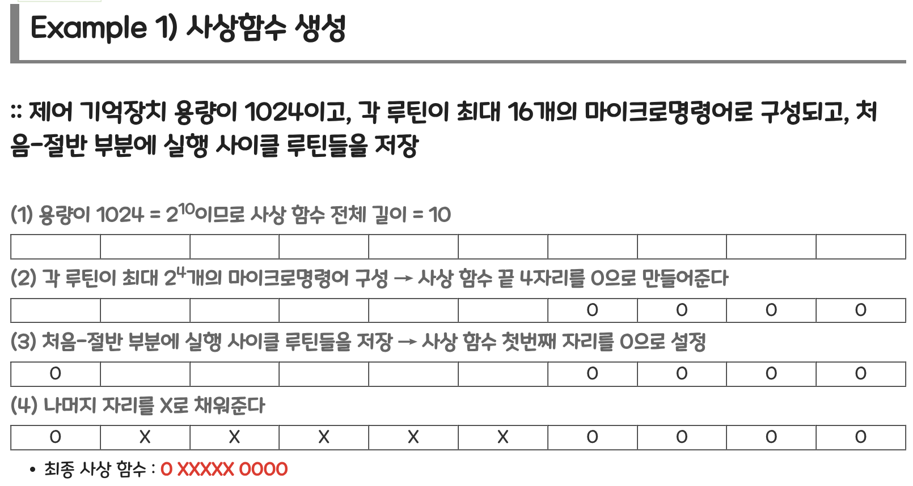

# 목차 
[1. 제어 유니트의 기능](#제어-유니트의-기능)  
[2. 제어 유니트의 구조](#제어-유니트의-구조)  
[3. 마이크로 명령어의 형식](#마이크로-명령어의-형식)  
[4. 명령어 사이클 루틴](#명령어-사이클-루틴)  
[5. 마이크로 프로그래밍](#마이크로-프로그래밍)  

# 제어 유니트

#### 제어 유니트의 기능
* 제어 유니트가 수행하는 주요 기능
    - 명령어 코드 해독
    - 명령어 실행에 필요한 제어 신호들의 발생
* 명령어 사이클 루틴
    1. 인출 사이클
    2. 간접 사이클
    3. 실행 사이클
    4. 인터럽트 사이클

 

* 프로그램 카운터에 저장되어있는 다음 멸령어의 주소를 MAR로 이동 -> 메모리의 MAR 위치에 있는 데이터를 MBR로 이동 -> 카운터 1증가 -> MBR에 있는 데이터의 해독을 위해 IR로 이동
* 루틴 - 명령어 인출과 같은 CPU의 특정 기능을 위하여 그룹 단위
* 명령어 사이클을 위한 마이크로 프로그램은 인출 사이클 루틴, 간접 사이클 루틴, 그리고 실행 사이클 루틴들로 구성

  

#### 제어 유니트의 구조

* 명령어 해독기 - IR(Instruction Register)로부터 들어오는 명령어의 연산 코드를 해독하여 해당 연산을 수행하기 위한 루틴의 시작 주소를 결정
* 제어 주소 레지스터(Control Address Register: CAR) - 다음에 실행할 마이크로 명령어의 주소를 저장하는 레지스터
* 제어 기억장치(Control Memory) - 마이크로 명령어들로 이루어진 마이크로 프로그램을 저장하는 내부 기억장치
* 제어 버퍼 레지스터(Control Buffer Register: CBR) - 제어 기억장치로부터 읽힌 마이크로 명령어를 일시적으로 저장하는 레지스터
* 서브루틴 레지스터(SuBroutine Register: SBR) - 마이크로 프로그램에서 서브루틴이 호출되는 경우에, 현재의 CAR 내용을 일시적으로 저장하는 레지스터
* 순서 제어 모듈(Sequencing Module) - 마이크로 명령어의 실행 순서를 결정하는 회로들의 집합

###### 사이클
* 매핑 방식(사상 방식) - 명령어의 연산 코드를 특정 비트 패턴과 조합
    1. 제어 기억장치의 용량이 2w라면 사상합수 전체 길이 = w
    2. 각 루틴이 최대 n개의 마이크로명령어로 구성된다면 2k = n을 만족하는 k에 대해서 사상함수 끝 k자리를 0으로 만듬
    3. 실행 사이클이 처음~절반이면 사상함수 첫번째 자리를 0, 절반~끝이라면 사상함수 첫번째 자리를 1
    4. 2,3 방법을 통해 구현하고, 사상함수의 남은 자리를 x로 채움
* 예시

 

#### 명령어 사이클 루틴
###### 인출 사이클 루틴
1. t(0): PC -> MAR
2. t(1): M[MAR] -> MBR/PC +1 -> PC
3. t(2): MBR -> IR 
###### 간접 사이클 루틴
1. t(0): IR(addr) -> MAR
2. t(1): M[MAR] -> MBR
3. t(2): MBR -> IR(addr)
###### 실행 사이클 루틴
* NOP
    1. t(0): PC +1 -> PC
* LOAD(I)
    1. t(0): IR(addr) -> MAR
    2. t(1): M[MAR] -> MBR
    3. t(2): MBR -> AC
* STORE(I)
    1. t(0): IR(addr) -> MAR
    2. t(1): AC -> MBR
    3. t(2): MBR -> M[MAR]
* ADD
    1. t(0): IR(addr) -> MAR
    2. t(1): M[MAR] -> MBR
    3. t(2): AC + MBR -> AC
* SUB
    1. t(0): IR(addr) -> MAR
    2. t(1): M[MAR] -> MBR
    3. t(2): AC - MVR -> AC
* JUMP
    1. t(0): IR(addr) -> PC

#### 마이크로 명령어의 형식
* 연산 필드 - 연산 필드의 개수만큼 마이크로 연산을 동시에 수행 가능
* 조건 필드(CD) - 분기에 사용될 조건 플래그를 지정 (if, switch문과 같은 조건문)
* 분기 필드(BR) - 분기의 종류, 다음에 실행할 마이크로 명령어의 주소를 결정하는 방법을 명시
* 주소 필드(ADF) - 분기가 발생하는 경우, 목적지 마이크로 명령어의 주소로 사용

 

#### 마이크로 프로그래밍
###### 수직적 마이크로 프로그래밍
* 마이크로 명령어의 opcode에 encoded bits를 포함
* 해독기를 통해서 그 bit들이 필요한 수 만큼의 제어 신호들로 확장하는 방식
* 장점 - 마이크로 명령어의 길이(bit 수) 최소화 -> 제어 기억장치 용량 감소
* 단점 - 해독 동작에 걸리는 만큼의 지연시간 발생

###### 수평적 마이크로 프로그래밍
* 연산 필드의 각 비트와 제어신호를 1:1로 대응시키는 방식
* 필요한 제어 신호 수만큼의 비트들로 이루어진 opcode bit들이 마이크로 명령어에 포함되어야 함
* 장점 - 하드웨어가 간단하며 해독에 따른 지연 시간 x, 추가적인 하드웨어(해독기)가 필요 x
* 단점 - 마이크로 명령어의 비트수가 길어지기 떄문에 제어 기억장치 용량이 증가